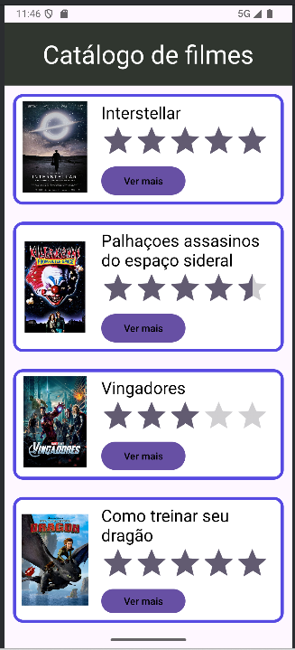

# 🎬 Catálogo de Filmes
 
Um aplicativo simples de catálogo de filmes desenvolvido para fins acadêmicos. Ele exibe três filmes com imagem, título e avaliações, utilizando **RelativeLayout** para organizar e sobrepor elementos de forma visualmente agradável.
 
---
 
## 📱 Demonstração
  
Exemplo:  

 
---
 
## 🚀 Funcionalidades
 
- 📌 Exibição de 3 filmes com pôster, título e avaliações
- 🖼️ Layout com imagens e textos
- 📱 Interface simples e responsiva
 
---
 
## 🧩 Estrutura do Layout
 
O projeto utiliza **RelativeLayout** como base:  
 
- Permite posicionamento mais livre dos elementos  
- Facilita sobrepor imagem, texto e notas  
- Ajuda a criar um design mais próximo de apps reais de catálogo
 
---
 
## 🛠️ Tecnologias Utilizadas
 Android Studio IDE
 Kotlin
 
---
 
## 📂 Como executar
 - Instale como zip
 - Abra o android Studio em importe o arquivo extraido

---

## 👤Grupo
 - Fernando Miguel
 - Gustavo Benatti
 - Kenzo Yoshida
 - Luan Alves
 - Mauro Geraldo
 - Samuel Soares
